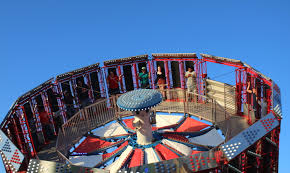

# Quiz on Centripetal Acceleration

Name___________________________________________

**1. 5pts**
The fair ride shown above has people standing around the edge of a large spinning wheel.  Assume the wheel is horizontal, not tilted, and that its radius is 3.6m.  How fast, in m/s, must the wheel turn in order for the people to feel one gravity (10 m/s^2) of acceleration at their back?  Show your work.

$\frac{v^2}{3.6} = 10 m/s^2$ (2pts)\
$v^2 = 36$ (1pts)\
v = 6 m/s (2pts with prolog only)

**2. 5pts**
How long will it take the wheel to do one complete turn at the speed you calculated?  How many radians/sec is that?

Circumference = $\tau(3.6) = 22.6m$ (1pt)\
$22.6/6 = 3.77s$ (2pt)\
$6/3.6 = 1.67 R/s$ (2pt)

